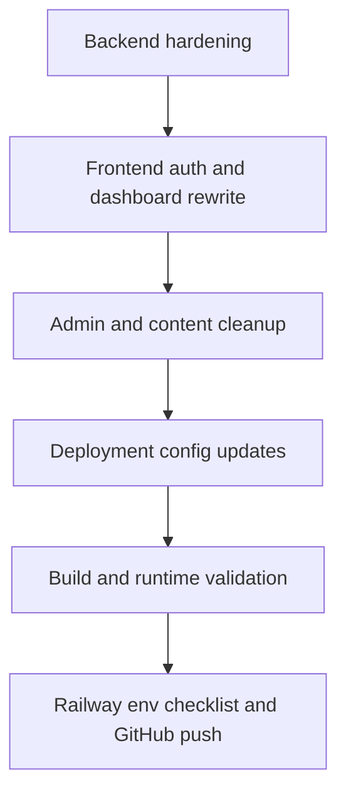

# RAZE production-readiness plan

## Summary

The current repository is partially aligned with the requested production target, but several critical gaps remain between the requested outcome and the actual code in the workspace.

Most important mismatches found:

- Local profile creation is still active in [`src/App.tsx`](src/App.tsx:288) and [`src/api.ts`](src/api.ts:116)
- The frontend still presents test-shell language and simulated auth in [`src/App.tsx`](src/App.tsx:208), [`src/App.tsx`](src/App.tsx:316), [`src/App.tsx`](src/App.tsx:342), and [`src/App.tsx`](src/App.tsx:350)
- Admin access still relies on a keyboard shortcut in [`src/App.tsx`](src/App.tsx:68)
- CORS still falls back to wildcard mode in [`server/index.js`](server/index.js:378)
- [`.env.example`](.env.example:1) does not yet document the Google OAuth variables required by the backend
- [`src/data/changelog.ts`](src/data/changelog.ts:3) still contains test-era entries and planned items that conflict with the requested production messaging

## Execution plan

1. Harden backend authentication and HTTP policy in [`server/index.js`](server/index.js:1)
   - Keep Google OAuth as the only session creation flow
   - Verify the callback flow, state cleanup, and verified-email enforcement
   - Tighten CORS to avoid unsafe wildcard defaults in production
   - Review response payloads so provider endpoints, raw secrets, and provider-branded internals are not leaked through public routes or user-facing error messages
   - Confirm graceful shutdown remains compatible with Railway

2. Replace simulated frontend auth with real Google-only UX in [`src/api.ts`](src/api.ts:1) and [`src/App.tsx`](src/App.tsx:1)
   - Remove [`createUserSession`](src/api.ts:116) usage and related local profile creation flows
   - Add frontend helpers for starting Google auth, clearing session, uploading avatar, and refreshing authenticated user state
   - Update dashboard UX so API key creation requires an authenticated Google session with verified email
   - Replace URL-based avatar editing with file-drop avatar upload wired to backend storage
   - Remove test-only wording and simulated-login messaging across landing, dashboard, login modal, status, and changelog surfaces

3. Finish admin and product content cleanup in [`src/App.tsx`](src/App.tsx:1) and [`src/data/changelog.ts`](src/data/changelog.ts:1)
   - Remove Ctrl+M-style discoverability references and other test harness affordances
   - Ensure status page describes current operational posture without placeholder language
   - Align release notes with the actual production-ready feature set only

4. Finalize Railway deployment configuration in [`package.json`](package.json:1), [`Dockerfile`](Dockerfile:1), [`nixpacks.toml`](nixpacks.toml:1), and [`.env.example`](.env.example:1)
   - Ensure scripts and runtime dependencies support local run and Railway deploy
   - Document all required and optional environment variables, including Google OAuth settings
   - Keep Docker and Nixpacks startup aligned with the backend entrypoint and built frontend assets

5. Validate and hand off implementation outputs in Code mode
   - Run the relevant build and startup validation
   - Prepare the exact Railway environment variable checklist from the final code
   - Prepare the GitHub push sequence after code changes are complete

## Implementation order

## Files expected to change

- [`server/index.js`](server/index.js:1)
- [`src/api.ts`](src/api.ts:1)
- [`src/App.tsx`](src/App.tsx:1)
- [`src/styles.css`](src/styles.css:1)
- [`src/data/changelog.ts`](src/data/changelog.ts:1)
- [`.env.example`](.env.example:1)
- [`README.md`](README.md:1)
- [`package.json`](package.json:1)
- Possibly [`Dockerfile`](Dockerfile:1) and [`nixpacks.toml`](nixpacks.toml:1) if validation reveals drift

## Acceptance criteria

- Sessions can only be created through Google OAuth
- API keys require `google` auth method and verified email
- Avatar upload works through backend persistence and serve route
- No test-only or placeholder auth messaging remains in user-facing production screens
- CORS is production-safe and configurable
- Required Railway env vars are fully documented
- Build passes and startup path is coherent for local and Railway deployment
